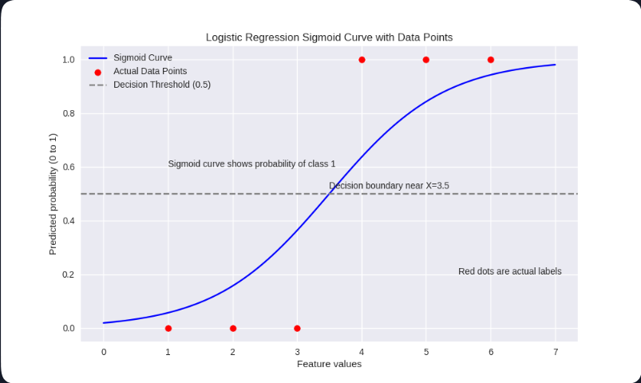

## Core of the Logistic Regression Model
This model is built on the linear regression, means both are similar. Instead of just predicting continues values, we apply the sigmoid function to the linear output and get probabilities between 0 and 1. The result is a smooth sigmoid curve which models the likelihood of class membership in the binary classification. 

The line **"models the likelihood of the class membership"** means:

1) Models the likelihood...: The model doesn’t say this specific output *belongs* to a class; it gives the *likelihood* (there is a specific chance that this output belongs to a particular class).  
   For example: If the output is 0.95, we say there is a 95% chance that it belongs to class 1.

2) Class membership: As this is a classification model, there will be different classes, so an output belongs to some class — either 1 or 0, as an example.

## How Does the Model Work
1) We take the data, as the first thing of the process.
- First difference is the formula of the model which is: `y_pred = 𝜎(z) = 1 / (1 + e^-z)` where `z = m * x + c`
   - `y_pred` is the predicted value and the `z` is sigmoid function `𝜎(z)` which squashes the output between 0 and 1.
2) We calculate the loss using the loss function, which is a common step done. From many of the loss functions here we use the binary cross entropy (log loss). 
   - The loss function: `loss = -[y.log(y_pred) + (1 - y).log(1 - y_pred)]`, **where `y` is the actual value and `y_pred` is the predicted value.** 
   - Reason behind using this specific loss function as default:
      - As we are predicting the probabilities, log loss measure how well those probabilities match those true labels.
      - Log loss is defined from the Bernoulli distributed outcomes, so minimizing the loss means maximizing the likelihood.
      - Log loss is convex, so that the gradients can easily find the global minimum.
      - MSE treat the errors linearly, which doesn’t make sense in the classification process.
      - Log loss focuses on how confident the model is, and that the crucial thing here.
           
3) Now comes the optimization step.
- This step is common and same as it is done in the linear regression. 

4) Example image of the logistic regression
<!-- fixed path: use the actual filename in ../images/ -->
