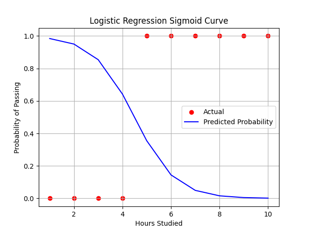

## 1) two views of logistic regression
I recmomend you to view the code once.
not always the curve strarts form the bottom left and end up at right top. it depends on what you are trying to do.
1) in the 15th line of code, if you use [:,1]:
    - you will the output as follow
    - 
    - thats because, you are focusing on predicting the positive class and as the output increases, the probability of the class 1 increases.
2) if use the [:,0]:
    - the output will be as follow
    - 
    - the curve flips, thats because you are focusing on the predicting the negatice class and as the output increases, the probability of the class 0 increases.
