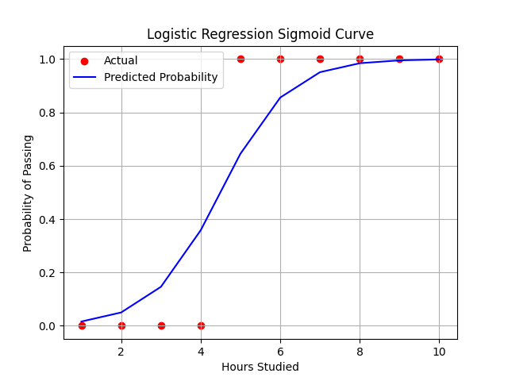
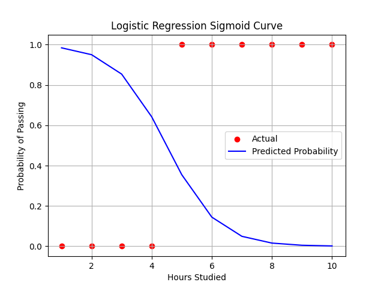

## 1) Two Views of Logistic Regression
I recommend you to view the code once.
Not always the curve starts form the bottom left and end up at right top. It depends on what you are trying to do.
1) In the 15th line of code, if you use `[:, 1]`:
    - You will the output as follow
    - 
    - Thats because, you are focusing on predicting the positive class and as the output increases, the probability of the class 1 increases.
2) If use the `[:, 0]`:
    - The output will be as follow
    - 
    - The curve flips, thats because you are focusing on the predicting the negative class and as the output increases, the probability of the class 0 increases.
